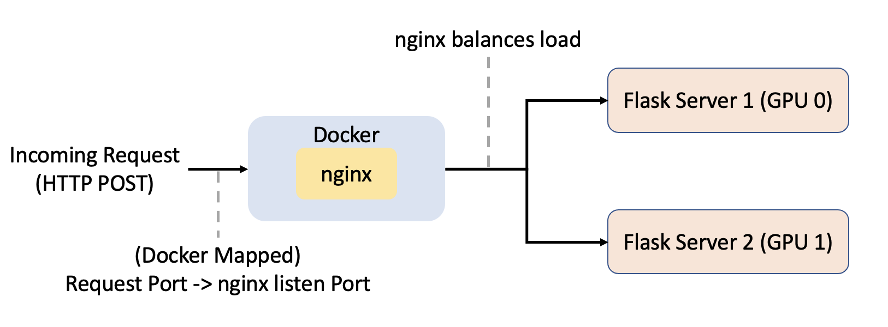
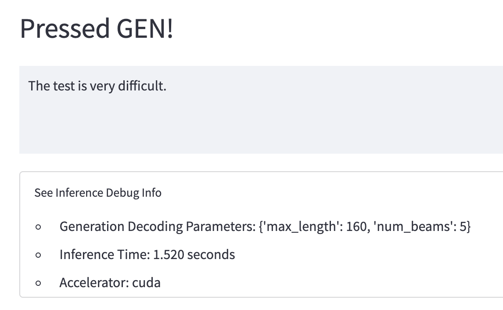
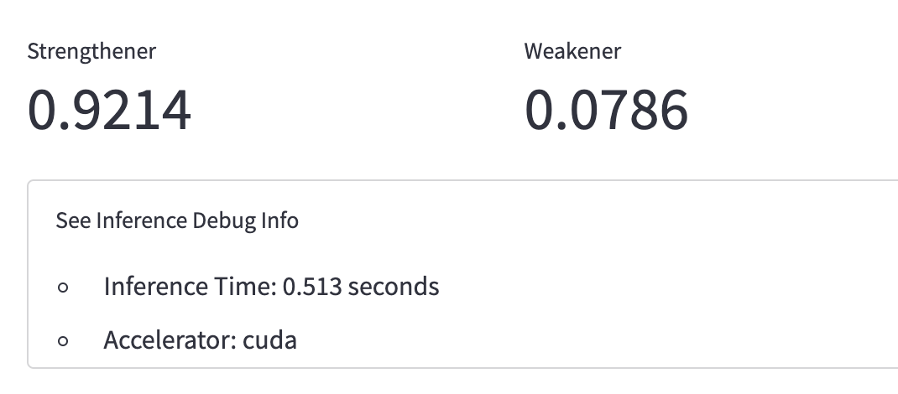

# defeasible_conflict_gen

Model trained with code from [here](https://github.com/id4thomas/defeasible-nli)

## Inference Serving Overview

* nginx로 포트 들어오면 알아서 밸런스 해서 지정해둔 다른 ip,port로 라우팅
* 백그라운드에서 flask 서버 여러개 열어 두고 거기에 쓰는 포트들 매핑함
* 포트 하나당 환경 변수 세팅해서 지피유 번호 지정

### File Structure
```
└── nginx_configs - nginx Configuration Files
    └── gen_atomic.conf

└── inf_configs - HTTP Request configurations
    └── clf_config.json
    └── gen_config.json

# Server scripts
└── run_nginx.sh
└── run_streamlit.sh
└── run_flask_servers.sh

# Streamlit Page Files
└── streamlit_app.py - Main streamlit Page
└── st_gen_page.py - defines Generative Inference Page
└── st_clf_page.py - defines Classification Inference Page

# Flask Server Files
└── inference_gen.py - defines /predict_gen route
└── inference_clf.py - defines /predict_clf route

# Huggingface Transformer Model Inference Codes
└── defeasible_gen_model.py
└── defeasible_clf_model.py
└── utils.py
```

## Demo
### Generative Inference
<!--  -->


### Classification Inference


## To-Do
* Accelerate inference by converting model to onnx format
* Multiple-worker with gunicorn